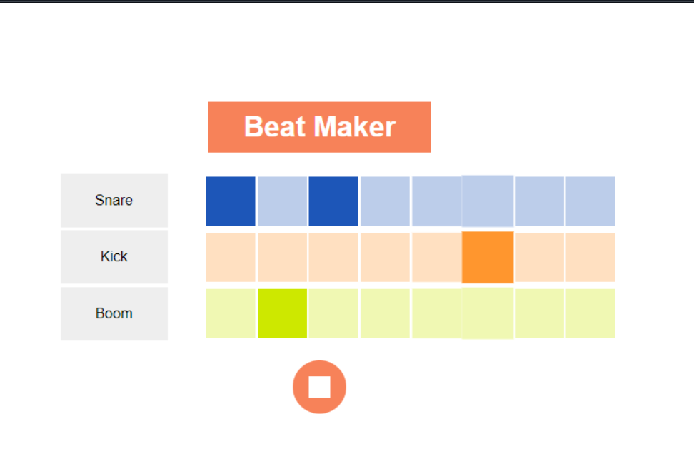

# 🎵 Beat Maker  

## 🚀 Overview  

Beat Maker is a responsive web project built using **HTML, CSS, and JavaScript**.  
It allows users to create custom beats by combining **snare, kick, and boom sounds** in an interactive interface.  

This project is designed as a **frontend-only application** for learning, practice, and portfolio showcase.  

---

# ✨ Features  

- ✅ Interactive beat-making interface  
- ✅ Play snare, kick, and boom sounds  
- ✅ Responsive layout for all devices  
- ✅ Keyboard and click-based sound triggers  
- ✅ Visual feedback animations  
- ✅ Mobile-friendly design  

---

# 🛠️ Technologies Used  

| Technology | Purpose |
|------------|----------|
| HTML5 | Structure and markup |
| CSS3 | Styling, responsiveness, animations |
| JavaScript (ES6) | Sound logic, interactions |

---

# 📂 Project Structure  

```text
BeatMaker/
│
├── demo.html
├── demo.css
├── demo.css.map
├── demo.js
|── demo.scss
└── README.md
```

---

# 🎮 Controls & Interactions  

| Feature | Function |
|----------|-----------|
| Snare Button | Plays snare sound |
| Kick Button | Plays kick sound |
| Boom Button | Plays boom sound |
| Keyboard Shortcuts | Trigger sounds via keys |
| Responsive Layout | Optimized for desktop, tablet, and mobile |

---

# 📱 Responsive Design  

This project works smoothly across:  

- 💻 Desktop  
- 🖥️ Laptop  
- 📱 Mobile  
- 📲 Tablet  

---

# ▶️ How to Run  

## 1️⃣ Clone the Repository  

```bash
git clone https://github.com/dhairyagothi/100_days_100_web_project/tree/Main/public/BeatMaker.git
```

## 2️⃣ Navigate to Project Folder  

```bash
cd BeatMaker
```

## 3️⃣ Open in Browser  

Open `demo.html` in your browser.  

---

# 🌐 Demo & Repository  

🔗 Live Demo: [https://dhairyagothi.github.io/100_days_100_web_project/public/BeatMaker/demo.html](https://dhairyagothi.github.io/100_days_100_web_project/public/BeatMaker/demo.html)  

🔗 GitHub Repository: [https://github.com/dhairyagothi/100_days_100_web_project/tree/Main/public/BeatMaker](https://github.com/dhairyagothi/100_days_100_web_project/tree/Main/public/BeatMaker)  

---

## 📸 Screenshots  




---

# 📄 License  

This project is created for **educational, learning, and portfolio purposes**.  

You are free to modify and use this project for personal development and practice.  

---

✨ This README now reflects your **Beat Maker project** with snare, kick, and boom sound features.  

