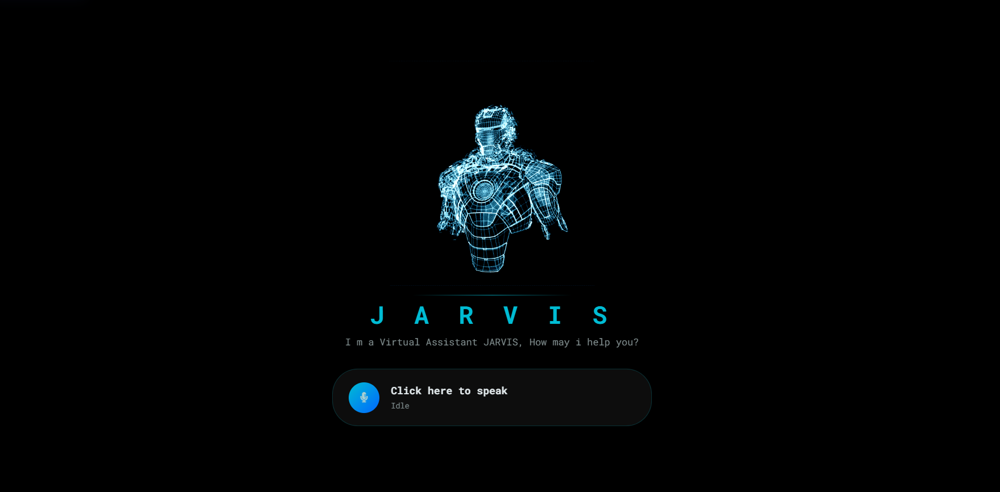
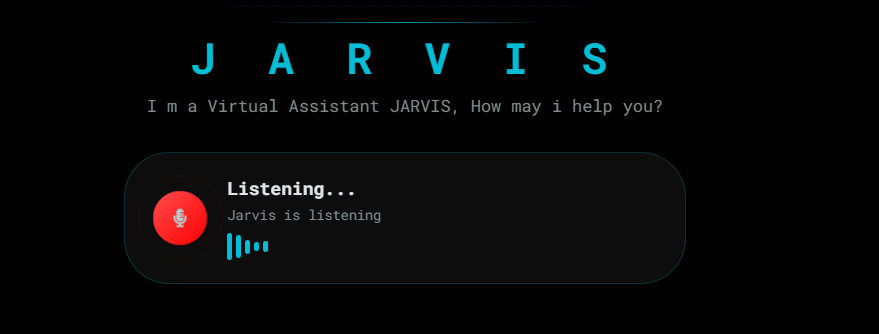

# JARVIS - Virtual Assistant

## Description

JARVIS is a browser-based virtual assistant built with HTML, CSS, and JavaScript.
It uses the **Web Speech API** to listen to your voice commands and respond using
**Speech Synthesis (TTS)**. It can open websites, search Google and Wikipedia, tell the time and date, and greet you based on the time of day — all hands-free.
The UI features a animated particle background and a live wave animation while listening.

---

## Features

- 🎤 Voice-activated — click the mic and speak naturally
- 🔊 Text-to-Speech responses using Web Speech Synthesis
- 🌐 Opens Google, YouTube, Facebook on command
- 🔍 Searches Google and Wikipedia for any query
- 🕐 Tells current time and date on request
- 🧮 Opens system Calculator on command
- 👋 Greets you based on time of day (Morning / Afternoon / Evening)
- 🌊 Live wave animation while listening
- ✨ Animated particle background using particles.js
- 📱 Responsive design for mobile and desktop

---

## Technologies Used

- HTML5
- CSS3
- JavaScript ES6
- Web Speech API (SpeechRecognition + SpeechSynthesis)
- particles.js (via CDN)
- Font Awesome 5 (via CDN)
- Google Fonts — Roboto Mono

---

## Installation/Setup

1. Clone the repository
2. Navigate to the project folder
3. Make sure `giphy.gif` and `avatar.png` are present in the same folder
4. Open `index.html` directly in Chrome or Edge
5. Enjoy the Project

> ⚠️ **No server or installation required.** Just open the file in a supported browser.

---

## Usage

1. Open `index.html` in **Chrome or Edge** (required for Web Speech API)
2. Allow microphone access when prompted
3. Click the **microphone button**
4. Speak one of the supported commands:

| Command | Action |
|---|---|
| `"hello"` / `"hey"` | JARVIS greets you |
| `"open google"` | Opens Google in a new tab |
| `"open youtube"` | Opens YouTube in a new tab |
| `"open facebook"` | Opens Facebook in a new tab |
| `"what is [topic]"` | Searches Google for the topic |
| `"who is [person]"` | Searches Google for the person |
| `"wikipedia [topic]"` | Opens Wikipedia for the topic |
| `"time"` | Tells the current time |
| `"date"` | Tells today's date |
| `"calculator"` | Opens system Calculator |
| _anything else_ | Searches Google automatically |

> ⚠️ **Browser Compatibility:** Web Speech API is supported on **Chrome and Edge only**.
> Firefox and Safari are not supported.

---

## Screenshots





```
public/Jarvis-AI-main/
├── index.html       # Main HTML file
├── style.css        # Styles and animations
├── app.js           # Voice recognition and command logic
├── giphy.gif        # JARVIS avatar animation
└── avatar.png       # Favicon
```
---

## 🔐 Google Sign-In Setup

JARVIS supports **"Continue with Google"** on the login/signup screen.
Out of the box the button is wired up — you only need to supply your own **Google OAuth 2.0 Client ID** to make it live.

### Step-by-step

1. **Go to Google Cloud Console**
   [https://console.cloud.google.com](https://console.cloud.google.com)

2. **Create (or select) a project**, then navigate to:
   `APIs & Services` → `Credentials` → `+ CREATE CREDENTIALS` → `OAuth 2.0 Client ID`

3. **Set Application type** to **Web application**.

4. **Add Authorized JavaScript origins** — the origin you'll serve the project from:
   | Environment | Origin to add |
   |---|---|
   | Local file (double-click) | `http://localhost` |
   | Live Server / VS Code | `http://127.0.0.1:5500` |
   | GitHub Pages | `https://your-username.github.io` |

5. Click **Create** and copy the generated **Client ID**
   (looks like `1234567890-abcdef.apps.googleusercontent.com`)

6. **Open `app.js`** and find the single line near the bottom of the file:

   ```js
   // ── Line to edit ───────────────────────────────────────────────────
   const GOOGLE_CLIENT_ID = "YOUR_GOOGLE_CLIENT_ID.apps.googleusercontent.com";
   ```

   Replace the placeholder with your copied Client ID:

   ```js
   const GOOGLE_CLIENT_ID = "1234567890-abcdef.apps.googleusercontent.com";
   ```

   > That's it — **no other file needs to be changed.**

7. Reload `index.html` and click **Continue with Google**.
   JARVIS will greet you by the name from your Google account. 🎉

### How it works (briefly)

- Google opens a secure popup → you approve → Google returns an **access token**
- JARVIS uses that token to call `googleapis.com/oauth2/v3/userinfo` and reads your **name**
- The name is stored in **`sessionStorage`** (temporary — cleared when the tab closes)
- Jarvis speaks: *"Hello [Your Name]. I am Jarvis, your virtual assistant."*

> ⚠️ **No backend required.** Everything runs in the browser.
> The Google access token is never stored on disk.

---

## Contributing

Contributions are welcome! If you'd like to improve this project:

1. Fork the repository
2. Create a new branch (`git checkout -b feature/your-feature`)
3. Commit your changes (`git commit -m 'Add your feature'`)
4. Push to the branch (`git push origin feature/your-feature`)
5. Open a Pull Request

---

## License

MIT License

---

## README Author

- **Saubhagya Srivastava**
- GitHub: [Saubhagya1621](https://github.com/Saubhagya1621)
- LinkedIn: [Saubhagya Srivastava](https://www.linkedin.com/in/saubhagyasri/)🚀
