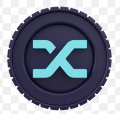

# 🎹 Audio Wave Synth & Visualizer

An interactive browser-based synthesizer and real-time audio visualizer built using the **Web Audio API**, **HTML5 Canvas**, and **Vanilla JavaScript**. Experiment with different oscillator waveforms, adjust volume and octave settings, play notes using your mouse or keyboard, and watch live frequency animations respond instantly to every sound.



---

## ✨ Features

* 🎼 **Interactive Virtual Piano** with clickable keys
* 🎹 **Computer Keyboard Support** for quick note playback
* 🌊 **Multiple Oscillator Waveforms**

  * Sine
  * Triangle
  * Square
  * Sawtooth
* 📊 **Real-Time Audio Visualizer** powered by HTML5 Canvas
* 🔊 **Master Volume Control**
* 🎵 **Octave Shifting** (Octaves 1–7)
* ⚡ **Instant Audio Playback** using the Web Audio API
* 📱 **Responsive Design** for desktop and mobile devices
* 🎨 Modern glassmorphism-inspired user interface
* 🚀 Lightweight with zero external JavaScript libraries

---

## 📸 Preview

The application includes:

* Live frequency spectrum visualizer
* Interactive piano keyboard
* Waveform selection controls
* Volume adjustment slider
* Octave controls
* Audio activation overlay
* Responsive and modern UI

---

## 🚀 Getting Started

### 1. Clone the repository

```bash
git clone https://github.com/100_days_100_web_project.git
```

### 2. Navigate to the project directory

```bash
cd audio-wave-synth
```

### 3. Run the project

Simply open **index.html** in any modern browser.

> **Note:** Browsers require a user interaction before enabling the Web Audio API. Click **Enable Audio & Start Synthesizer** to begin.

---

## 🎮 How to Use

1. Open the application in your browser.
2. Click **Enable Audio & Start Synthesizer**.
3. Choose your preferred waveform.
4. Adjust the volume and octave controls.
5. Play notes using:

   * Your mouse
   * Touch controls
   * Computer keyboard
6. Watch the real-time frequency spectrum react to every note.

---

## ⌨️ Keyboard Shortcuts

### White Keys

| Keyboard | Note |
| -------- | ---- |
| A        | C    |
| S        | D    |
| D        | E    |
| F        | F    |
| G        | G    |
| H        | A    |
| J        | B    |
| K        | C5   |

### Black Keys

| Keyboard | Note |
| -------- | ---- |
| W        | C#   |
| E        | D#   |
| T        | F#   |
| Y        | G#   |
| U        | A#   |

---

## 🎛️ Controls

### Waveforms

* Sine
* Triangle
* Square
* Sawtooth

### Volume

Adjust the master output volume using the range slider.

### Octave

Increase or decrease the keyboard octave between **1** and **7**.

---

## 🛠️ Built With

* HTML5
* CSS3
* JavaScript (ES6+)
* Web Audio API
* HTML5 Canvas API

---

## 📂 Project Structure

```
Audio-Wave-Synth/
│
├── index.html
├── style.css
├── script.js
├── image.png
└── README.md
```

---

## ⚙️ Core Technologies

### Web Audio API

* OscillatorNode
* GainNode
* AnalyserNode
* AudioContext

### Canvas API

* Real-time frequency spectrum rendering
* Animated visualization loop
* Responsive canvas resizing

---

## 🌟 Highlights

* Real-time sound synthesis
* Frequency spectrum visualization
* Smooth audio envelope for cleaner playback
* Dynamic waveform switching
* Mouse, touch, and keyboard support
* Responsive layout
* Accessible controls using ARIA attributes

---

## 💡 Future Improvements

* MIDI keyboard support
* Recording and exporting audio
* ADSR envelope controls
* Delay and reverb effects
* Multiple oscillator layers
* Polyphonic chord mode
* Preset sound library
* Dark/Light theme switcher
* Audio recording and playback
* MIDI file import

---

## 🌐 Browser Support

Works in all modern browsers supporting the Web Audio API:

* ✅ Google Chrome
* ✅ Microsoft Edge
* ✅ Mozilla Firefox
* ✅ Safari

---

## 🤝 Contributing

Contributions are welcome!

If you'd like to improve the synthesizer, visualizer, or user interface:

1. Fork the repository.
2. Create a new feature branch.
3. Commit your changes.
4. Open a Pull Request.

---

## 📄 License

This project is licensed under the **MIT License**.

---

## ⭐ Support

If you found this project useful or enjoyed experimenting with it, consider giving it a **⭐ Star** on GitHub!

Happy Synthesizing! 🎹🎶

## 👨‍💻 Author

**Mohammed Omer Farooq** — GSSoC 2026 Contribution
