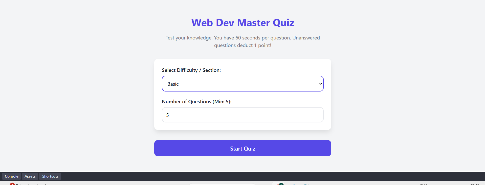
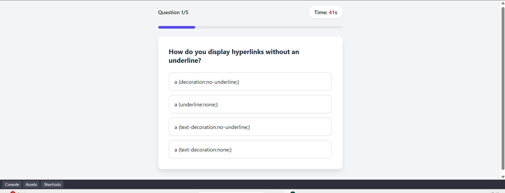
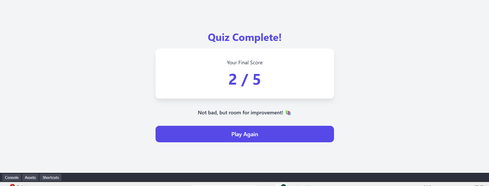

# Web Dev Quiz App

## Description
An interactive, browser-based quiz application designed to test web development knowledge. It features dynamic question rendering, a countdown timer, and customizable quiz settings, built entirely with Vanilla JavaScript to demonstrate complex state management.

## Features
- Selectable difficulty levels (Basic, Intermediate, Advanced, Miscellaneous)
- Customizable quiz length (Minimum 5 questions)
- 60-second countdown timer per question with auto-deduction for timeouts
- Dynamic progress bar tracking completion percentage
- Randomized question pooling and option shuffling
- Instant visual feedback (Red/Green highlighting)
- Responsive, modern card-based UI

## Technologies Used
- HTML5
- CSS3
- JavaScript ES6

## Installation/Setup
1. Clone the main repository.
2. Navigate to the `public/WebDevQuizApp/` directory.
3. No build tools are required for this specific project.

## Usage
1. Open `index.html` in any modern web browser or use a local dev server.
2. Select your desired category and number of questions.
3. Click "Start Quiz" to begin.
4. Answer within 60 seconds to avoid a point deduction!

## Screenshots

## Contributing
Please refer to the main repository's `CONTRIBUTING.md` file. Ensure you run `npm run format` and `npm run lint` from the root directory before pushing any changes.

## License
MIT License

## Author
https://github.com/soumyasync