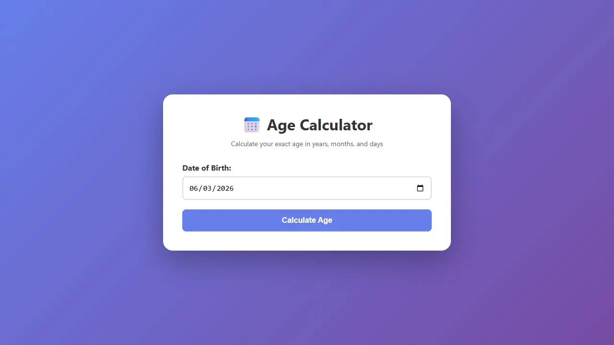

# Age Calculator — LifePulse

A precise, responsive age calculator that goes beyond a simple years/months/days count — with birthday countdowns, zodiac signs, planetary ages, and shareable results.



## Features

- Calculate exact age in years, months, and days
- Auto-fills today's date
- Next birthday countdown
- Zodiac sign & Chinese zodiac display
- Total weeks, days, hours, minutes, and seconds lived
- Fun facts (e.g. estimated heartbeats, time spent sleeping)
- Planetary age comparison (Mercury through Saturn)
- Date difference calculator and birthday card generator (see `difference.html` / `birthday.html`)
- Dark mode toggle
- Responsive design for mobile
- Keyboard support (Enter key)

## Technologies Used

- HTML5
- CSS3
- JavaScript (ES6)

## How to Run Locally

1. Clone the repository:
```bash
   git clone https://github.com/dhairyagothi/100_days_100_web_project.git
```
2. Navigate to this project folder:
```bash
   cd 100_days_100_web_project/public/age-calculator
```
3. Open `index.html` directly in your browser, or serve it locally:
```bash
   npx serve .
```

## How to Use

1. Select your date of birth
2. Click "Calculate Age" or press Enter
3. View your exact age and additional info
4. Explore the **Difference**, **Birthday Card**, and **About** pages via the nav bar

## Live Demo

Part of the [100 Days 100 Web Projects](https://100-days-100-web-project.vercel.app) collection.