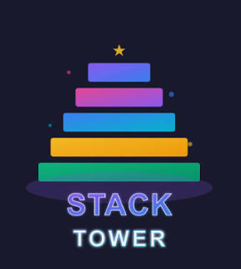

# 🏗️ Tower Blocks Stacker

A fun and addictive browser-based stacking game where precision and timing are the keys to success. Drop moving blocks on top of each other, build the tallest tower possible, and challenge yourself to achieve the highest score.



---

## 🎮 Features

- 🧱 Smooth block stacking mechanics
- 🎯 Precision-based gameplay
- 📈 Increasing difficulty as your tower grows
- ⏸️ Pause and resume functionality
- 🔄 Restart game anytime
- 📊 Live score tracking
- 🎨 Colorful blocks with dynamic color generation
- 📱 Responsive design for desktop and mobile
- ⌨️ Keyboard and mouse/touch controls

---

## 📸 Preview

The game features:

- Modern UI with a clean HUD
- Animated moving blocks
- Smooth camera scrolling as the tower grows
- Start, Pause, and Game Over overlays
- Neon-inspired game interface

---

## 🚀 How to Play

1. Click **Start Game**.
2. Wait for the moving block to align with the tower.
3. Click anywhere on the game canvas or press the **Spacebar** to drop the block.
4. Perfectly align each block to keep the tower growing.
5. The overlapping portion remains while the excess falls away.
6. Miss the tower completely and the game ends.

---

## 🎯 Controls

| Action | Control |
|---------|----------|
| Drop Block | Mouse Click |
| Drop Block | Spacebar |
| Pause / Resume | Pause Button |
| Restart | Restart Button |

---

## 🛠️ Built With

- HTML5
- CSS3
- JavaScript (Vanilla)
- HTML5 Canvas API

---

## 📂 Project Structure

```
Tower-Blocks-Stacker/
│
├── index.html
├── style.css
├── script.js
├── image.png
└── README.md
```

---

## ⚙️ Game Mechanics

- Every successfully placed block increases your score.
- The width of each new block depends on the overlap with the previous one.
- Less overlap means a narrower block.
- Missing the tower completely results in Game Over.
- Block movement speed gradually increases, making the game more challenging.
- The camera smoothly follows the growing tower.

---

## 🎨 Features Breakdown

### Dynamic Difficulty
- Block speed increases as more blocks are stacked.
- Higher towers require greater precision.

### Camera Scrolling
- The viewport follows the tower upward, keeping gameplay centered.

### Pause System
- Pause anytime during gameplay.
- Resume exactly where you left off.

### Responsive Controls
Supports:
- Mouse
- Keyboard
- Touch devices

---

## 📈 Scoring

- ✅ +1 point for every successful block placement.
- Build the tallest tower possible to achieve a new high score.

---

## 💡 Future Improvements

- High score saving using Local Storage
- Sound effects and background music
- Combo bonuses for perfect placements
- Particle effects
- Difficulty levels
- Leaderboard support
- Animated falling block pieces
- Multiple themes and skins

---

## ▶️ Getting Started

1. Clone the repository

```bash
git clone https://github.com/100_days_100_web_project.git
```

2. Navigate to the project folder

```bash
cd tower-stacker
```

3. Open `index.html` in your preferred browser.

No installation or additional dependencies are required.

---

## 🤝 Contributing

Contributions are welcome!

If you'd like to improve gameplay, optimize performance, or add new features:

1. Fork the repository.
2. Create a feature branch.
3. Commit your changes.
4. Open a Pull Request.

---

## 📄 License

This project is licensed under the MIT License.

---

## ⭐ Show Your Support

If you enjoyed this project, consider giving it a ⭐ on GitHub!

Happy Stacking! 🏗️